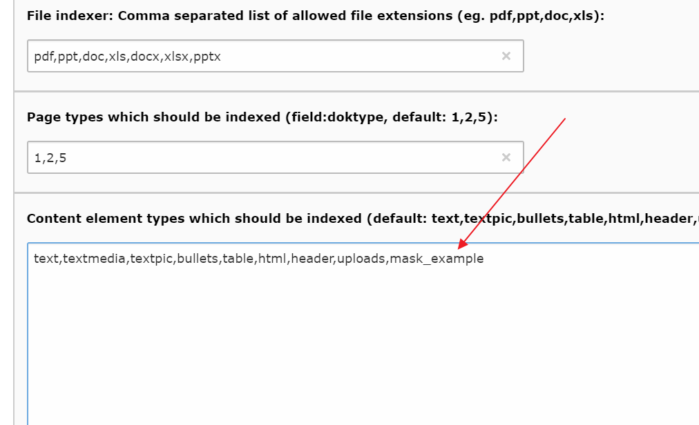

.. ==================================================
.. FOR YOUR INFORMATION
.. --------------------------------------------------
.. -*- coding: utf-8 -*- with BOM.

.. _start:

=====================
mask_kesearch_indexer
=====================

An indexer for mask elements with ke_search

Just install. It hooks up in page-/content-indexer.

Add your mask content to the content elements, which should be indexed in the indexer config.

